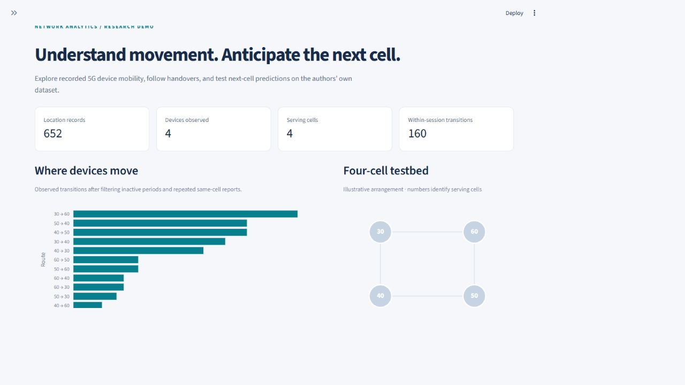
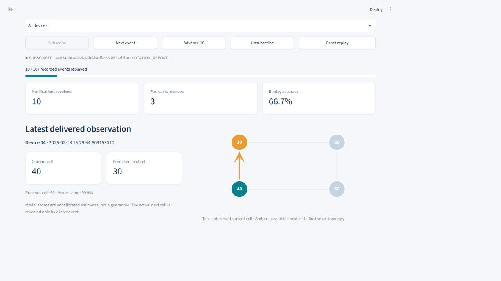
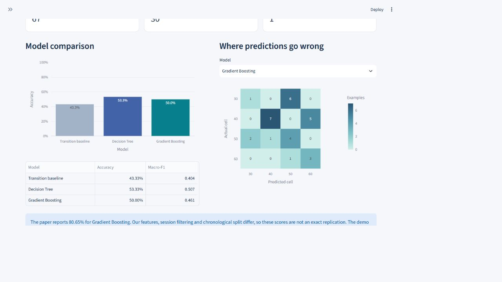
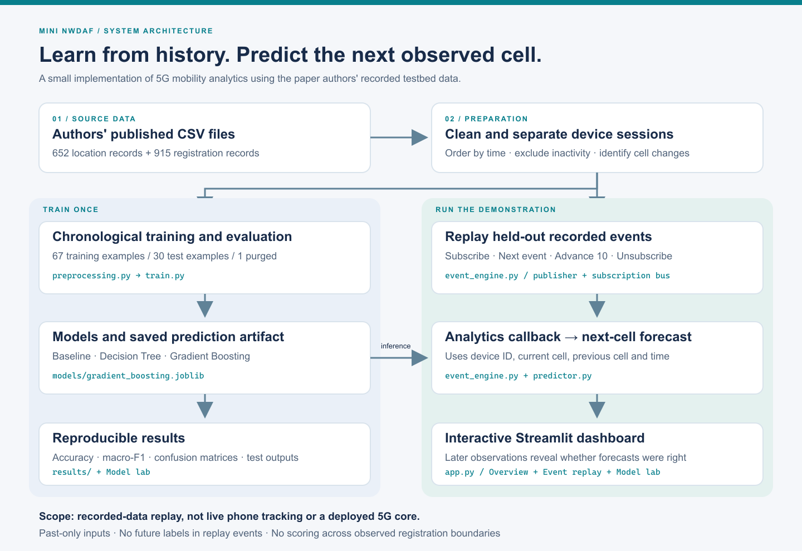
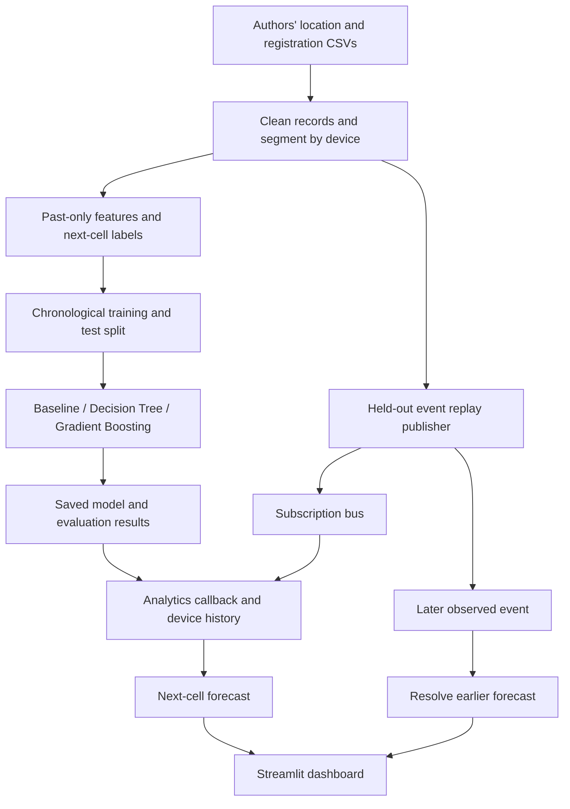

# Mini NWDAF — 5G Mobility Analytics & Next-Cell Prediction

A small, working implementation of selected concepts from **Enhanced Open-Source
NWDAF for Event-Driven Analytics in 5G Networks**. It uses the authors' actual
published testbed CSVs, trains next-cell classifiers, and demonstrates event
subscriptions through an interactive Streamlit dashboard.

**This is an educational analytics prototype.** It replays recorded observations;
it does not deploy Free5GC, communicate with a live radio network, or implement
the complete 3GPP NWDAF API.

## How it works — simple explanation

Imagine four mobile-network cells named **30, 40, 50 and 60**. A device can move
between them. Our program reads the paper authors' recorded observations and
tries to predict **which cell the device will visit next**.

There are two separate stages:

### 1. Learn from old records (training)

`download_data.py` downloads the authors' location and registration files.
`preprocessing.py` sorts the observations by device and time and separates
registration sessions. `train.py` then teaches the models using earlier records
and tests them using later records. The trained prediction model is saved locally.

For example, a recorded sequence `30 → 40 → 50` can teach the model that a device
was previously in cell 30, is currently in cell 40, and next appeared in cell 50.
The model learns patterns across many examples; it does not simply assume every
device follows this route.

### 2. Use the saved model (demonstration)

Start the Streamlit app, open **Event replay**, click **Subscribe**, and then click
**Next event** or **Advance 10**. Each step delivers a recorded location observation.

This is an illustrative example, not a claimed output for a particular source row:

| Step | What arrives | What the app does |
|---|---|---|
| 1 | Device 1 is observed in cell 30 | Stores its observed cell |
| 2 | The same device is observed in cell 40 in the same session | Recognizes the cell change and predicts a possible next cell, such as 50 |
| 3 | A later observation says the device is in cell 50 | Checks the earlier prediction and counts it as correct |

If step 3 reports cell 60 instead, the prediction is counted as wrong. The app
does not know that future observation when making the prediction. Replay starts
with earlier history already available, so it can sometimes forecast immediately.

```text
Authors' recorded data → next recorded event → subscribed analytics handler
                                                    ↓
                                     previous + current cell + device + time
                                                    ↓
                                           saved prediction model
                                                    ↓
                                        prediction on the dashboard
                                                    ↓
                             later recorded event checks whether it was right
```

**Subscribe** connects the event stream to the analytics handler. **Unsubscribe**
disconnects it: advancing the stream still consumes records, but the notification
count stops increasing. **Reset replay** returns to the beginning of the test stream.

### Is it real time? Do I have to run a 5G network?

**This version is a manual replay of recorded data.** It does not track your phone,
receive current cell-tower signals, or generate live device movement. The interface
updates when you advance events, but the events themselves were recorded earlier.
No Free5GC, UERANSIM, SIM card or physical 5G equipment is needed for this version.

A separate live simulator and receiving server were discussed as a possible
extension. **They are not included in this version.** The original paper's full
system requires its network testbed to run and produce live notifications.

### What do I run first?

On a new computer, follow **Quick start** below in this order:

1. Install Python and the packages in `requirements.txt`.
2. Run `download_data.py` once to get the authors' data.
3. Run `train.py` once to create the trained model and evaluation results.
4. Run `python -m streamlit run app.py` to start the dashboard.
5. Open **Event replay → Subscribe → Advance 10** to demonstrate it.

On the already-configured computer, double-click `START_WINDOWS.cmd`.
Training does not need to run again every time you open the dashboard.

### One sentence for the presentation

> This project uses the research paper authors' recorded 5G testbed data to
> analyze device movement, predict the next serving cell, and demonstrate
> subscription-based event processing through a small Python application.

## Student details

Fill these in before submission.

| Field | Value |
|---|---|
| Name | Add your name |
| Roll number | Add your roll number |
| Class / division | Add your class |
| Course / assessment | Add your course and assessment |
| Project title | Mini NWDAF: Event-Driven 5G Mobility Analytics and Next-Cell Prediction |

## Contents

- [Simple explanation](#how-it-works--simple-explanation)
- [Reference paper](#reference-paper)
- [Objectives](#problem-statement-and-objectives)
- [Paper-to-project mapping](#paper-to-project-mapping)
- [Technology and AI concepts](#technology-and-ai-concepts)
- [Installation and running](#quick-start)
- [Dashboard screenshots](#dashboard)
- [Architecture](#architecture)
- [Data and machine learning](#data-preparation-and-machine-learning)
- [Tests](#tests)
- [Demo and viva guide](docs/DEMO_GUIDE.md)
- [Limitations](#limitations-and-possible-future-work)

## Reference paper

Henok Daniel, Omar Alhussein, Jie Liang, Cheng Li, and Ernesto Damiani,
*Enhanced Open-Source NWDAF for Event-Driven Analytics in 5G Networks*.
[arXiv:2601.01838](https://arxiv.org/abs/2601.01838).

- [Authors' implementation and dataset](https://github.com/HenokDanielbfg/5g-testbed-conference)
- [Selected source dataset](https://github.com/HenokDanielbfg/5g-testbed-conference/tree/d6fae0dbd7cf70343201f9351fe60498b628bb86/core%20dataset/03%20Feb%202025%20-%2018%20Feb%202025)

## Problem statement and objectives

Can a small analytics component use a device's recorded movement history to
predict its next serving cell, and deliver those insights when new events arrive?

1. Prepare the authors' location and registration records without mixing devices
   or treating reconnects as continuous movement.
2. Derive past-only features and a next-cell target.
3. Compare supervised learning with an interpretable transition baseline.
4. Demonstrate subscribe → notify → predict → unsubscribe through local callbacks.
5. Show measured results, individual errors, and clear implementation boundaries.

## Paper-to-project mapping

| Paper concept | Implementation | Scope |
|---|---|---|
| Event subscriptions and notifications, III-B / Fig. 3 | `EventBus`, `ReplaySession` | In-process Python callbacks; no NRF discovery or HTTP interfaces |
| UE mobility analytics, IV-A / Fig. 5 | Route counts, cell timeline, source viewer | Recorded testbed observations |
| Next-cell prediction, IV-B | Decision Tree and Gradient Boosting | Simplified feature set; chronological holdout |
| ML comparison | Transition-frequency baseline + accuracy, macro-F1, confusion matrix | Actual computed evaluation |
| Free5GC / AMF / SMF / UERANSIM | Source of the original dataset | Not installed or reimplemented |

The project follows the small, modular classroom-prototype presentation style
of [ai_theorem_prover](https://github.com/harshit-s23/ai_theorem_prover). Its source
code is not reused here. The NWDAF paper and authors' data are the research basis.

## Technology and AI concepts

| Component | Technology | Purpose |
|---|---|---|
| Language | Python 3.12 | Data preparation, model training and event processing |
| Interface | Streamlit | Interactive dashboard and replay controls |
| Data processing | pandas, NumPy | Clean source records and create past-only features |
| Machine learning | scikit-learn | Decision Tree, Gradient Boosting and evaluation |
| Visualization | Plotly | Mobility charts, cell diagram and confusion matrices |
| Model storage | joblib | Save and load the locally trained model |
| Verification | pytest, Streamlit AppTest | Unit, integration and interface checks |

AI concepts demonstrated: **supervised learning**, **multiclass classification**,
**feature engineering**, **baseline comparison**, and **held-out evaluation**.
Subscription delivery is ordinary event-driven software, not an AI algorithm.
All predictions are calculated by the local trained model; no LLM or cloud AI API
is involved.

## Quick start

Clone this repository first, or download and extract its ZIP from GitHub:

```bash
git clone https://github.com/Parth9267/AI_5g-mini-nwdaf-.git
cd AI_5g-mini-nwdaf-
```

**Python 3.12 recommended** (the version used for verification). Runs locally on
Windows, Linux or macOS. Internet is needed for package installation and the
one-time dataset download; no API keys or paid services are required.

### Windows PowerShell

From the project folder:

```powershell
py -3.12 -m venv .venv
.\.venv\Scripts\python.exe -m pip install -r requirements.txt
.\.venv\Scripts\python.exe download_data.py
.\.venv\Scripts\python.exe train.py
.\.venv\Scripts\python.exe -m streamlit run app.py
```

Using the environment's Python directly avoids PowerShell activation-policy issues.
After setup, you can double-click **`START_WINDOWS.cmd`**.

### Linux / macOS

```bash
python3 -m venv .venv
source .venv/bin/activate
python -m pip install -r requirements.txt
python download_data.py
python train.py
python -m streamlit run app.py
```

Open **http://localhost:8501**. Keep the terminal running. Stop with Ctrl+C.
If data or models are missing, the app also offers download and train buttons.

`requirements-lock.txt` records the complete environment used for the checked
results. To reproduce those exact package versions on Python 3.12, install it
instead of `requirements.txt`. The latter allows compatible package updates.

## Dashboard

### Overview



### Event replay



### Model evaluation



- **Overview:** source counts, within-session transition routes, four-cell diagram,
  device timeline, and a source-data preview.
- **Event replay:** subscribe to recorded location reports, step once or ten times,
  inspect the current prediction, reveal later outcomes, and unsubscribe.
- **Model lab:** compare classifiers and baseline, inspect confusion matrices,
  export metrics, and retrain reproducibly.
- **About the paper:** research mapping, architecture, limitations, and demo steps.

The cell layout is illustrative; it is not measured radio coverage or a
geographical map, and these display coordinates are not used by the model.

## Architecture



[Download the architecture image](assets/architecture.png) · [Editable vector version](assets/architecture.svg)

The two paths share the authors' data: one trains and evaluates a model, while
the other replays held-out observations through a subscribed analytics handler.



## Data preparation and machine learning

The selected source contains **652 location records**, **915 registration
records**, **4 devices**, and **4 serving cells** (30, 40, 50, 60).
See [data/README.md](data/README.md) for filtering details and source limitations.

For each device, records are sorted in time. Each observed inactive registration
state creates a boundary. Location reports during known inactivity are excluded;
consecutive same-cell reports within a segment are collapsed.

For a within-session sequence `30 → 40 → 50`, the input is previous cell `30`,
current cell `40`, device identity and current event time; the target is `50`.
Neither the future destination nor a future dwell duration enters the features.

Inputs:

- Device ID, current cell, previous cell (one-hot encoded).
- Time category: night 22:00–06:00, morning 06:00–11:00, lunch 11:00–14:00,
  afternoon 14:00–18:00, evening 18:00–22:00. These boundaries are a project choice.
- Sine/cosine of the hour of day, so midnight and late evening are close numerically.

The paper additionally uses cell coordinates and visit-frequency information.
Those are omitted here. This is a simplified implementation, not an exact replication.

Models:

| Model | Configuration / idea |
|---|---|
| Transition baseline | Most frequent next cell for the current cell, learned only from training |
| Decision Tree | Maximum depth 5, minimum leaf size 3, random seed 42 |
| Gradient Boosting | 100 estimators, maximum depth 9, learning rate 0.05, seed 42 |

Gradient Boosting parameters follow Section IV-B. All settings are fixed in
advance, with no tuning on test data. The replay uses Gradient Boosting because
it is the paper's highlighted model, not because it wins this holdout.

### Evaluation

Examples are split approximately 70%/30% by **time**, not randomly. Training rows
are also removed if their next-cell target occurs at or after the cutoff. The
encoder is fitted on training data only. The final split contains **67 training
examples, 30 test examples, and 1 purged boundary example**.

| Model | Test accuracy | Macro-F1 |
|---|---:|---:|
| Transition baseline | 43.33% | 0.4039 |
| Decision Tree | 53.33% | 0.5075 |
| Gradient Boosting | 50.00% | 0.4611 |

These are measured results from this implementation. The paper reports **80.65%**
for Gradient Boosting on its own setup. The filtering, features and split differ,
so the numbers are not directly comparable. Only 30 test examples remain: one
prediction changes accuracy by approximately 3.33 percentage points. Avoid claims
of statistically established superiority from this small holdout.

The same devices occur in training and testing. This tests later movement of
known devices, **not** generalization to unseen subscribers. Model probability
scores are uncalibrated and can be overconfident.

Generated evidence:

- [Measured results](results/RESULTS.md)
- [Full metrics and confusion matrices](results/metrics.json)
- [Every held-out prediction](results/test_predictions.csv)
- [Source commit and checksums](data/manifest.json)

## Event replay semantics

The publisher sends only `type`, `time`, `supi`, `cell`, and a registration segment.
It never sends the next-cell target. The handler resolves an existing forecast
when the next observation arrives for that device and segment, then makes a
new forecast from the observed history.

Replay begins at the test cutoff; history is seeded with earlier observations.
New sessions require enough history before prediction. Forecasts at session/end
boundaries without a subsequent observation remain unscored. Unsubscribing stops
delivery and clears history/pending forecasts; otherwise missed events could
create a false continuity. Resubscribing starts learning the visible history again.

The full subscribed replay reproduces the saved Gradient Boosting holdout
predictions exactly; this is checked by an integration test.

## Tests

```powershell
.\.venv\Scripts\python.exe -m pytest -q
```

Tests cover identifier preservation, conflicting timestamps, registration
boundaries, removal of future training labels, subscription filtering,
unsubscribe behavior, deferred forecast scoring, real-data/replay consistency,
and all four Streamlit pages. Data/model-dependent tests skip in a source-only
checkout until the download and training steps have run.

## Project structure

```text
mini-nwdaf/
├── app.py                   # Dashboard and presentation
├── download_data.py         # Pinned source download + provenance
├── preprocessing.py         # Data cleaning, session grouping, temporal split
├── train.py                 # Models, baseline, metrics, saved artifact
├── predictor.py             # Forecast from observed history
├── event_engine.py          # Local subscription bus and replay
├── analytics.py             # Within-session transition statistics
├── START_WINDOWS.cmd        # Convenient local launcher
├── requirements.txt
├── requirements-lock.txt
├── data/                    # Documentation, manifest; raw CSVs ignored by Git
├── models/                  # Locally generated model; ignored by Git
├── results/                 # Reproducible metrics and held-out predictions
├── docs/DEMO_GUIDE.md        # Presentation and viva preparation
├── assets/                  # Dashboard screenshots
└── tests/                   # Unit, integration and Streamlit tests
```

## GitHub submission

Repository: [Parth9267/AI_5g-mini-nwdaf-](https://github.com/Parth9267/AI_5g-mini-nwdaf-).

1. Fill in the student-details table before assessment submission.
2. Include source, tests, README, docs, architecture images, screenshots and results.
3. Keep `.venv`, `__pycache__`, `data/raw`, `tmp`, and generated model binaries out
   of the repository; `.gitignore` already handles them.
4. Follow the quick start on the computer used for the demonstration.

If using the provided `mini-nwdaf.zip`, extract it first and upload the **contents
of its `mini-nwdaf` folder**, not just the ZIP file. `README.md` and `app.py` should
appear at the top level of the GitHub repository. Include the `.streamlit` folder
and `.gitignore` file as well as the visible source files and subfolders.

The ZIP contains the code, instructions, source manifest, screenshot, tests and
evaluation results. It deliberately excludes the Python environment, downloaded
raw data and generated model. Running the setup steps recreates those locally.

The two original CSVs are downloaded from the authors on setup rather than
bundled into your GitHub repository. Their data and code remain attributable to
their respective authors. This project does not relicense those materials.

## Limitations and possible future work

Small simulated dataset; approximate registration alignment; observed cell changes
are only a handover proxy; no live core integration; no calibration or tuning study;
no evidence of improved network latency or resource allocation. Potential extensions
are more source records, chronological validation for tuning, new-device evaluation,
and real HTTP subscription endpoints. Those are outside this assessment's scope.
